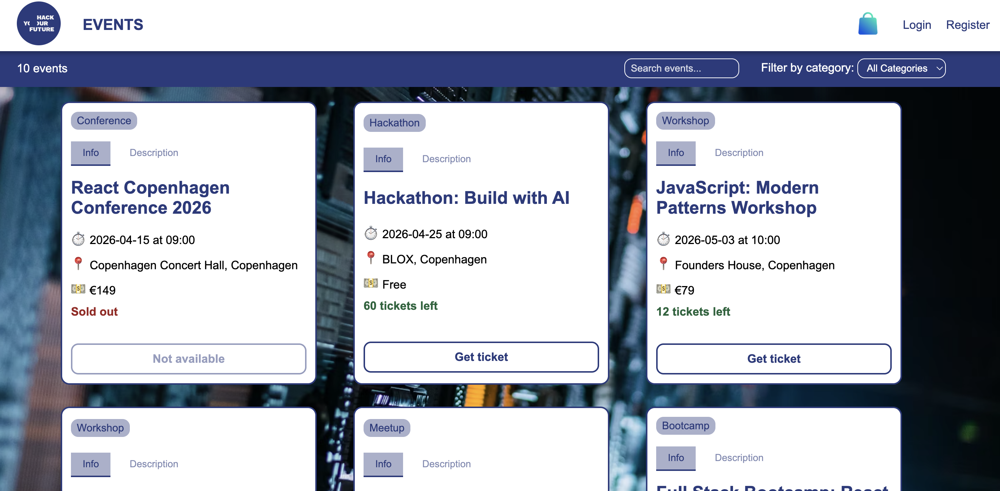
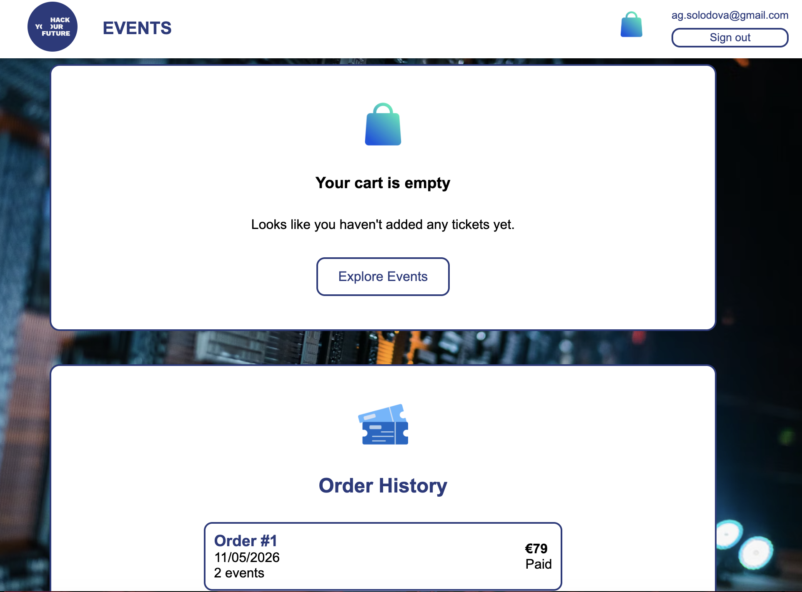
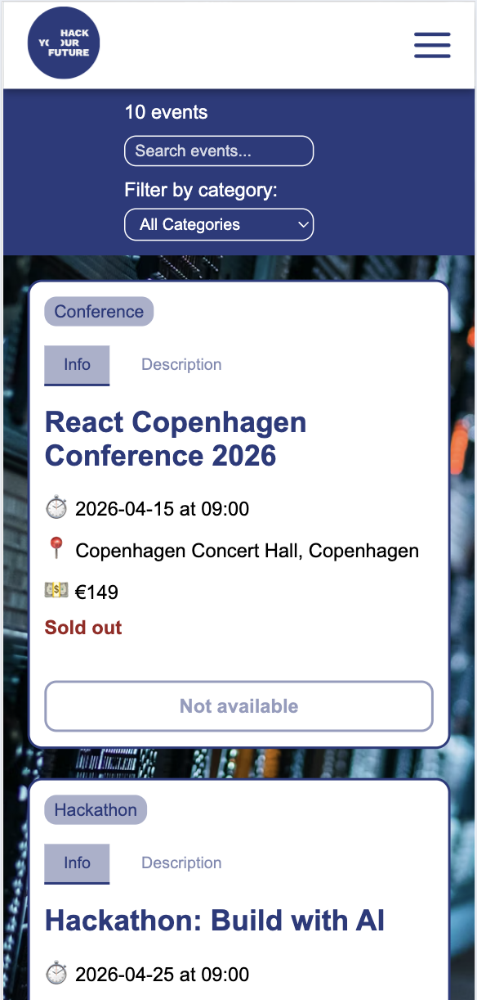

# 🎟️ Tech Events Platform

A modern, responsive full-stack web application for discovering tech events, workshops, and hackathons, featuring user authentication, an interactive shopping cart, and a personal order history. 

## 🚀 Live Demo
* **Vercel:** [[Click here](https://event-app-startup-hyf.vercel.app/)]
---

## 🛠️ Tech Stack

### Frontend
* **React** & **Vite** 
* **React Router DOM** 
* **Context API** (State management for Authentication, Cart, and Wishlist)
* **CSS3** (Custom responsive design with CSS variables)

### Backend
* **Hosted on:** Render.com (Web Service)
> ⏳ **Note on Loading Time:** The backend is hosted on Render's free tier. If the website hasn't been visited recently, the server goes into "sleep mode." Please allow **30–40 seconds** for the initial request (like loading events or signing in) to wake up the server. After that, everything will work instantly!
---

## ✨ Features

* **Event Discovery:** Browse through upcoming tech conferences, hackathons, and JavaScript workshops.
* **Responsive Layout:** Adaptive user interface with a custom smooth-animating mobile burger menu.
* **Authentication:** User registration and login using JWT tokens (handled via context).
* **Ticket Cart Management:** Add tickets, dynamically update quantities, and clear the cart.
* **Order History:** Authenticated users can view their past orders with real-time checkout simulation.

---
## 📸 Screenshots

  
Click to expand Screenshots

  
  ### Desktop View
  
  
  
  
  ### Mobile View 
  

